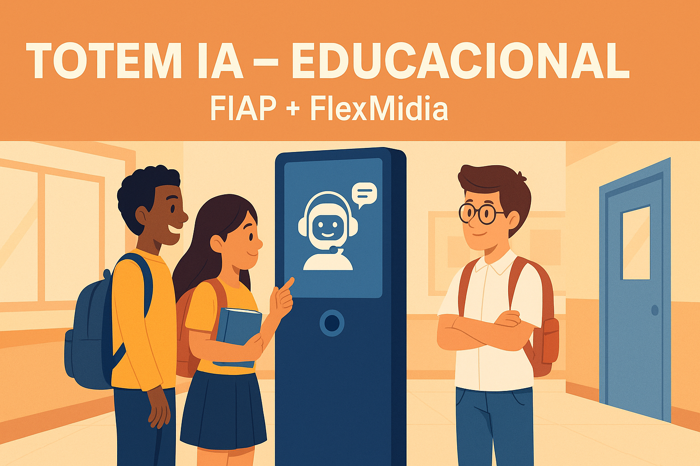

<!-- Banner (substitua o caminho pelo seu arquivo) -->
<p align="center">
  
</p>

<h1 align="center">🧠 TOTEM IA – Educacional (FIAP + FlexMidia)</h1>

<p align="center">
  <a href="https://www.python.org/"></a>
  <a href="#"></a>
  <a href="#"></a>
  <a href="#"></a>
  <a href="#"></a>
</p>

<p align="center">
  Solução de <b>IA educacional</b> para escolas públicas e privadas, com totem físico, interação por voz/texto, sensores e análise de dados em nuvem.
</p>

---

## 📌 Sumário
- [Descrição](#-descrição)
- [Definição das Tecnologias](#-definição-das-tecnologias)
- [Arquitetura Técnica](#-arquitetura-técnica)
- [Estratégia de Coleta de Dados](#-estratégia-de-coleta-de-dados)
- [Plano Inicial de Desenvolvimento e Responsabilidades](#-plano-inicial-de-desenvolvimento-e-responsabilidades)
- [Instalação & Execução (protótipo)](#-instalação-execução-protótipo)
- [Estrutura do Repositório]([#estrutura-do-reposit%C3%B3rio)
- [Parcerias e Aplicações](#-parcerias-e-aplicações)
- [Equipe](#-equipe)
- [Repositório & Evidência de Versionamento](#-repositório-evidência-de-versionamento)
- [Licença](#-licença)

---

# 🚀 **S.A.B.E.R.** - Sistema de Assistência Baseada em Evidências e Respostas

## 📖 Descrição
O **Totem IA** é uma solução de **inteligência artificial educacional** para escolas públicas e privadas.  
Promove uma experiência interativa de aprendizado via **totem físico com IA**, sensores (presença/ultrassom, ESP32-CAM) e **coleta de dados anônimos** para insights pedagógicos.

---

## 1. 🚩 Justificativa do Problema e Solução Proposta

### 1.1. O Problema
O ambiente educacional, especialmente no Brasil, enfrenta desafios crônicos:
* **Déficit de Personalização:** Professores gerenciam turmas grandes, tornando o atendimento individualizado e a resolução de dúvidas pontuais um desafio logístico.
* **Carga Operacional Docente:** Grande parte do tempo do professor é gasta respondendo dúvidas administrativas ou conceituais repetitivas, tempo que poderia ser usado para um ensino mais aprofundado.
* **Engajamento Digital:** Alunos "nativos digitais" muitas vezes percebem um descompasso entre as ferramentas tecnológicas que usam fora da escola e as disponíveis no ambiente de aprendizado.
* **Coleta de Dados Pedagógicos:** Escolas carecem de ferramentas que capturem, em tempo real, as principais dúvidas, o "sentimento" da turma ou os tópicos de maior dificuldade (além das provas tradicionais).

### 1.2. A Solução Proposta
Propomos o **"Totem S.A.B.E.R."**, uma solução de IA educacional composta por um terminal físico (totem) e uma plataforma de análise em nuvem.

**Descrição Funcional:**
* **Totem Físico:** Um totem interativo (similar aos da Flexmedia) posicionado em locais estratégicos (bibliotecas, pátios, corredores) da escola.
* **Interação Multimodal:** O aluno pode interagir via voz (em português natural) ou touch/texto.
* **Assistente de IA:** O totem atua como um "monitor de IA", capaz de:
    * Responder dúvidas factuais e conceituais (ex: "O que é mitose?", "Quando é a prova de geografia?").
    * Propor quizzes rápidos e desafios de aprendizado.
    * Coletar feedback anônimo dos alunos sobre as aulas ou o clima escolar.
* **Sensores e Análise Comportamental:** Sensores de presença ativam o totem. Uma câmera (com processamento ético e anonimizado) pode analisar o nível de engajamento no entorno (ex: "horas de pico de uso") ou o sentimento agregado (requer análise ética profunda e LGPD).
* **Plataforma Cloud:** Todos os dados de interação (anonimizados) são enviados para a nuvem, onde um dashboard permite que pedagogos e gestores visualizem:
    * Tópicos mais pesquisados.
    * Dúvidas mais frequentes (indicando gargalos no ensino).
    * Horários de maior fluxo.
    
---
## 2. 🛠️ Definição das Tecnologias

Para viabilizar essa solução, propomos o seguinte stack tecnológico focado no ecossistema Microsoft Azure:

### 2.1. Hardware (Totem Físico)
* **Estrutura:** Totem padrão Flexmedia com tela touch-screen.
* **Processamento Embarcado:** Mini-PC (ex: Intel NUC) ou placa (ex: Raspberry Pi 5 / NVIDIA Jetson Nano).
* **Áudio:** Microfone direcional (ex: ReSpeaker Mic Array) e alto-falantes.
* **Sensores:** Sensor de Presença (PIR) e Câmera (para fluxo).

### 2.2. Software (Local/Edge - No Totem)
* **Sistema Operacional:** Linux (ex: Ubuntu Server 22.04) ou Windows 10/11 IoT Enterprise.
* **Aplicação Front-End:** Aplicação Web em modo Kiosk (ex: React.js ou Vue.js).
* **IA na Borda (Edge AI):**
    * **Wake Word:** Picovoice ou Snowboy para detecção local.

### 2.3. Software (Nuvem/Cloud - Microsoft Azure)
* **Provedor de Nuvem:** Microsoft Azure.
* **Backend (API):** API RESTful central.
* **Linguagem:** Python (FastAPI) ou C# (.NET Core).
* **Hospedagem:** Azure App Service ou Azure Functions.
* **Serviços de IA (Core - Azure Cognitive Services):**
    * **Speech-to-Text (STT):** Azure Cognitive Services - Speech to Text.
    * **Text-to-Speech (TTS):** Azure Cognitive Services - Text to Speech (com vozes neurais).
* **NLU (Cérebro da IA):**
    * **Opção 1 (Gerenciada):** Azure Cognitive Services - LUIS (Language Understanding).
    * **Opção 2 (LLM):** Azure OpenAI Service (GPT-4o).
* **Banco de Dados:**
    * **Interações (NoSQL):** Azure Cosmos DB.
    * **Analítico (Data Warehouse):** Azure Synapse Analytics.
* **Análise e Visualização:**
    * **ETL/Processamento:** Azure Data Factory ou Azure Functions.
    * **Dashboard:** Power BI.
    
  ---
  
## 3. 🗺️ Arquitetura da Solução

<div align="center">
  
</div>


**Fluxo de Dados (Pipeline) no Azure:**
1.  **[Totem]** Aluno se aproxima e o Sensor PIR ativa a tela.
2.  **[Totem - Edge]** Aluno diz "Ei, S.A.B.E.R.". O motor de Wake Word local detecta e inicia a gravação de áudio.
3.  **[Totem -> Nuvem]** O totem envia o arquivo de áudio da pergunta para a API no Azure App Service.
4.  **[Nuvem - API]** A API orquestra os Azure Cognitive Services:
    a. Envia o áudio para o Azure Speech to Text.
    b. Recebe o texto transcrito.
    c. Envia o texto para o Azure LUIS ou Azure OpenAI Service para gerar a resposta.
    d. (Opcional) Consulta o Azure Cosmos DB para respostas administrativas.
    e. Envia a interação anonimizada para o Azure Synapse Analytics.
5.  **[Nuvem -> Totem]** A API retorna um JSON para o Totem contendo o texto da resposta e a URL do áudio (armazenado temporariamente no Azure Blob Storage).
6.  **[Totem]** O aplicativo local (React/Vue) exibe o texto e reproduz o áudio da resposta.
7.  **[Nuvem - Dashboard]** Gestores acessam o Power BI, que lê os dados analíticos consolidados do Azure Synapse Analytics.

## 4. 📊 Estratégia de Coleta de Dados

A coleta de dados respeitará rigorosamente a LGPD.

### Coleta Planejada (Pós-MVP):
* **O QUÊ:** Coletaremos apenas dados de interação anonimizados (textos das perguntas, tópicos, horários de uso).
* **ANONIMIZAÇÃO:** Nenhum dado de identificação pessoal (PII) será coletado.
* **TRANSPARÊNCIA:** O totem exibirá um aviso claro sobre a coleta de dados para fins de melhoria pedagógica.

### Coleta Simulada (Para o MVP/Projeto FIAP):
* Para o desenvolvimento inicial, usaremos um dataset sintético para treinar e testar o NLU (LUIS/OpenAI) sem usar dados reais de alunos.

---

## 5. 🗓️ Plano Inicial de Desenvolvimento e Responsabilidades

### Fases (Sprints Sugeridas)
* **Sprint 1: Definição e Setup**
    * (✔) Detalhar arquitetura (diagrama).
    * (✔) Setup do projeto na Cloud (AZURE).
    * (✔) Setup do repositório (Git).
    * (✔) Design inicial (Mockups) da interface do totem (Figma).
    * (✔) Desenvolvimento do protótipo funcional em Streamlit.
* **Sprint 2: MVP 2 (Core API & NLU)**
    * ( ) Criar a API REST (Python/FastAPI) no Azure App Service.
    * ( ) Configurar o NLU (Azure LUIS / OpenAI) com o dataset simulado.
    * ( ) Integrar API com os serviços de voz (Azure STT e TTS).
    * ( ) Testar endpoints: (Áudio -> API -> Texto -> NLU -> Resposta(Texto) -> API -> Áudio)
* **Sprint 3: MVP 3 (Interface Web Básica)**
    * ( ) Desenvolver o Front-End (React/Vue) em modo Kiosk.
    * ( ) Integrar Front-End com a API de voz (gravação de áudio e reprodução da resposta).
    * ( ) Montagem do protótipo físico (Totem Flexmedia).
    * ( ) [Desafio] Integrar Wake Word (Picovoice) e sensores (PIR) no hardware.
* **Sprint 4: MVP 4 (Integração de Voz)**
    * ( ) Criar o pipeline de dados (API -> Azure Synapse Analytics).
    * ( ) Desenvolver o Dashboard v1 (Power BI) lendo do Synapse.
    * ( ) Testes integrados (End-to-End) com hardware e software.
    * ( ) Refinamento e preparação para a apresentação final do Challenge.

---

## 💻 Instalação & Execução (protótipo)
> Pré-requisitos: Python 3.11+, Git, (opcional) FFmpeg para áudio.

```bash
# 1) Clonar
git clone https://github.com/lnosiqueira/Totem-IA-Educacional.git
cd Totem-IA-Educacional

# 2) Ambiente
python -m venv .venv
# Windows:
.venv\Scripts\activate
# macOS/Linux:
source .venv/bin/activate

# 3) Dependências (arquivo será adicionado nas próximas sprints)
pip install -r requirements.txt

# 4) Executar protótipo (ex.: Streamlit)
streamlit run app/app.py

```
---

## 📂Estrutura do Repositório

```bash
Totem-IA-Educacional/
├─ app/                 # Interface (Streamlit/Gradio)
├─ firmware/            # Códigos ESP32-CAM e sensores
├─ cloud/               # Infra, APIs, IaC (ex.: Terraform), diagramas
├─ data/                # Dados simulados para EDA (R/Python)
├─ notebooks/           # Exploração (R e Python)
├─ docs/                # Relatórios, proposta, diagramas
├─ assets/              # Imagens (banner, logos, ícones)
├─ tests/               # Testes
├─ README.md
└─ LICENSE

```
---

## 🤝 Parcerias e Aplicações

FIAP + FlexMidia
Projetado para Secretarias de Educação, redes públicas/privadas e empresas de tecnologia, visando expansão em escala com indicadores de engajamento e impacto educacional.

---

## 👥 Equipe

**Integrantes:**
* Leno Siqueira
* Mateus Lima
* Maria Mendes
* Paulo Benfica
* Fred Villagra

**Orientador:** André Godoi

**Tutora:** Sabrina Otoni

**Parceria:** FIAP + FlexMidia

---

## 🔗 Repositório & Evidência de Versionamento

Este repositório consolida código, protótipos, diagramas e relatórios do projeto.
Commits e PRs documentam a colaboração entre os integrantes.

---

## 🧾 Licença

Projeto acadêmico sob MIT License.
© 2025 FIAP + FlexMidia.
